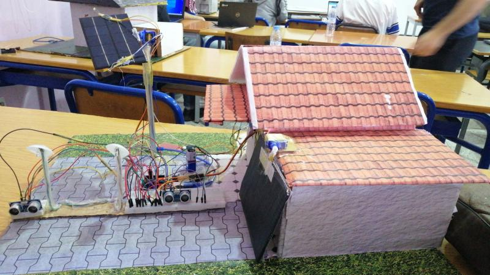

# SMART HOUSE – Portfolio du Projet Domotique

Bienvenue sur la page officielle du projet **SMART HOUSE** développé à partir de technologies Arduino dans le cadre de travaux d’instrumentation et de capteurs.

---

## 📘 Présentation

Ce portfolio décrit l’ensemble du système domotique développé :

* architecture,
* choix des capteurs,
* fonctionnement intérieur et extérieur,
* résultats observés,
* codes sources.

Le but est d’illustrer une intégration complète de capteurs et actionneurs pour automatiser une maison.

---

## 🏠 Système intérieur

### Images

### Description

Le module intérieur surveille température, humidité, pluie, flamme, fumée et bruits.
Il déclenche automatiquement les alertes et contrôle un servomoteur pour protéger le linge.

➡️ [Voir le code complet](Interior_SMART_HOUSE.ino)

---

## 🚗 Système extérieur

### Images

### Description

Le module extérieur gère la détection de passage, l’éclairage automatique, la porte de garage et le tracking solaire.

➡️ [Voir le code complet](Exterieur_SMART_HOUSE.ino)

---

## 🎯 Objectifs atteints

* Automatisation complète
* Détection multi-capteurs
* Gestion de plusieurs actionneurs
* Suivi solaire
* Système hybride intérieur / extérieur
* Fiabilité métrologique des mesures

---

## 📂 Dépôt GitHub

Vous pouvez consulter le code, les images et la documentation ici :

👉 **[https://github.com/najmechorouk/SMARTE-HOUSE](https://github.com/najmechorouk/SMARTE-HOUSE)**
